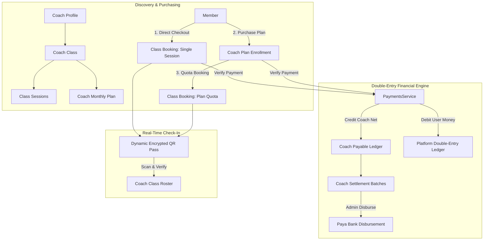

# GRAVITY — COACH CLASSES & MONTHLY PLANS
## Architectural Specification & Integration Blueprint

---

### 1. Executive Summary & Core Paradigm

Gravity's **Coach Classes** capability is a first-class native extension of the Gravity platform. It empowers independent coaches to publish, schedule, monetize, and manage physical or online classes across multiple venue formats:
- **Gravity Hub Gyms** (existing Gravity gym partners)
- **Partner Gyms** (affiliate gyms)
- **External / Non-Gravity Gyms**
- **Independent Studios & Venues**
- **Online Livestream Sessions**

#### The Non-Coercive Customer Funnel
Users are **never forced** into long-term subscriptions or locked packages:
$$\text{Discover Class} \longrightarrow \mathbf{Try\ Single\ Session} \longrightarrow \text{Optional Monthly Coach Plan}$$

- **Single Session Purchase**: The default, lowest-friction entry point ($300{,}000$ Toman average).
- **Monthly Coach Plan (Upsell)**: Offered optionally for members who love the coach ($8$ to $12$ sessions with volume discount).
- **Plan Quota Redemption**: Monthly plan holders book sessions deducting $1$ session quota from an auditable, append-only usage ledger.

---

### 2. High-Level Architecture & Domain Model

---

### 3. Data Integrity & Concurrency Safeguards

1. **Anti-Overbooking Atomicity**:
   - Every booking execution utilizes row-level locking (`SELECT ... FOR UPDATE`) on the targeted `class_sessions` row.
   - If `booked_seats >= capacity`, the transaction immediately aborts with `ConflictException('ظرفیت این جلسه تکمیل شده است.')`.
   - Seat assignment codes (e.g. `S-01`, `S-02`) are computed and stored atomically within the lock boundary.

2. **Monthly Plan Quota Concurrency**:
   - When a member books using their monthly plan, the active enrollment (`coach_plan_enrollments`) is locked `FOR UPDATE`.
   - Invariant: `used_quota < total_quota` and `valid_until >= CURRENT_DATE`.
   - Every quota mutation appends a record to `coach_plan_usage_ledger` with `action_type: PLAN_CONSUMED` and the resulting `remaining_sessions`.

3. **Cancellation & Quota Restoration**:
   - If a member cancels before the coach's cancellation deadline (e.g., $6$ to $12$ hours prior to start time):
     - For **Monthly Plan Bookings**: Quota is immediately restored, appending `action_type: CANCELLATION_RESTORE` to the ledger.
     - For **Single Session Bookings**: The coach's payable balance is debited by the net payout amount (`REFUND_DEDUCTION`), and the member's wallet balance or payment transaction is marked for refund.

---

### 4. Platform Revenue Sharing & Paya Settlements

1. **Configurable Commission**:
   - Configurable per coach in `coaches.commission_rate` (default $15\%$).
   - Upon verification of payment for class session or monthly plan:
     $$\text{Gross} = \text{PricePaid}$$
     $$\text{GravityCommission} = \text{Gross} \times \text{CommissionRate}$$
     $$\text{CoachNetEarning} = \text{Gross} - \text{GravityCommission}$$

2. **Payable Ledger Invariant**:
   - Stored in `coach_payable_ledger`.
   - Every entry specifies `delta_amount_tomans`, `balance_after`, `entry_type`, and `reference_id`.
   - Balance cannot drop below zero.

3. **Settlement Cycles**:
   - Batches created via `POST /coaches/admin/:id/settlements/generate`.
   - Upon bank Paya execution, marked `PAID` with tracking code via `POST /coaches/admin/settlements/:batchId/disburse`.

---

### 5. Role-Based Access Matrix

| Role | Discovery (`/classes`) | Class Detail (`/classes/:id`) | Member Passes (`/account`) | Coach Panel (`/coach`) | Admin Panel (`/admin`) |
| :--- | :---: | :---: | :---: | :---: | :---: |
| **GUEST** | View only | View only | Login required | Login required | 401 Unauthorized |
| **USER / MEMBER** | Browse & Search | Single & Monthly Checkout | View QR passes, Cancel | Switch/Apply | 403 Forbidden |
| **COACH** | Browse & Search | View & Book | View passes | Full Management | 403 Forbidden |
| **GYM_STAFF** | Browse | Browse | Personal | Redirect to /reception | 403 Forbidden |
| **ADMIN / SUPER_ADMIN** | Browse | Browse | Account | Coach Mode | Full Oversight |

---

### 6. Design System Conformance
- **Background**: Deep Obsidian Graphite `#0D0F11` / Surface `#15181B` / Elevated `#1D2125` / Border `#272B30`.
- **Primary Accent**: Electric Neon Lime `#C8F500` (Hover: `#D6FB33`, Active: `#B3DC00`, Alpha: `rgba(200,245,0,0.12)`).
- **Persian Typography**: Vazirmatn font with native Persian numerals (`toPersianDigits`) for all currency, counters, dates, and times.
