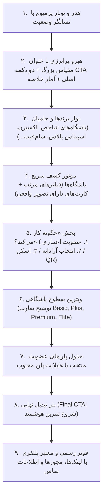

# سند حسابرسی بصری و آرت‌دایرکشن گراویتی (Gravity Premium Visual Audit & Art Direction)

**سمت:** طراح ارشد محصول و مهندس دیزاین فرانت‌اند (Lead Product Designer & Senior Frontend Design Engineer)  
**تاریخ گزارش:** ۲۹ سپتامبر ۲۰۲۶ (۸ مهر ۱۴۰۵)  
**دامنه:** حسابرسی بصری صرف، تحلیل تجربه کاربری، شناسایی علل ظاهر جنریک/تخم‌مرغی و تدوین آرت‌دایرکشن پرمیوم ورزشی-فناورانه (Sport-Tech)  
**قانون تغییرناپذیری:** این فاز صرفاً تشخیصی و تحلیلی است. هیچ کدی در کامپوننت‌ها، استایل‌ها، اقتصاد، توکن‌ها، امنیت QR، اندپوینت‌ها و دیتابیس تغییر داده نشده است.

---

## ۱. خلاصه مدیریتی (Executive Summary)

پلتفرم چندباشگاهی گراویتی (Gravity) از نظر معماری نرم‌افزاری، پایگاه داده، امنیت تراکنش‌ها، مکانیزم رمزنگاری بارکد پویا (QR)، تفکیک جنسیتی، شیفت‌های عبوری از نیمه‌شب و اقتصاد اعتباری (نامساوی سقف طلایی) در وضعیت تست‌شده، مقاوم و عملیاتی قرار دارد. 

با این حال، بررسی بصری بر روی مرورگر واقعی (کرومیوم در رزولوشن‌های دسکتاپ و موبایل) نشان می‌دهد که **تجربه کاربری و هویت بصری فعلی در سطح یک «داشبورد ساده SaaS / قالب پیش‌فرض خام» باقی مانده و فرسنگ‌ها با یک «پلتفرم ورزشی پرمیوم، هیجان‌انگیز و فناوری‌محور» فاصله دارد.**

### نمره کل کیفیت بصری جاری: ۲.۱ از ۵ (Weak / ضعیف متمایل به پذیرفتنی)
* **هویت برند و تأثیرگذاری حسی:** ۱.۸ / ۵ (فاقد تمایز، فاقد عکاسی ورزشی، بسیار خام)
* **ترکیب‌بندی صفحه اصلی (Hero & Layout):** ۲.۰ / ۵ (باکس تک‌رنگ شناور، فاقد دکمه فراخوان، فاقد ساختار لندینگ)
* **کارت‌ها و کامپوننت‌ها:** ۲.۲ / ۵ (افراط در کپسول‌ها و گوشه‌های به شدت گرد موسوم به «تخم‌مرغی»)
* **سیستم رنگی:** ۲.۴ / ۵ (استفاده از آبی استاندارد تیلویند بدون انرژی و روح ورزشی)
* **طراحی موبایل:** ۲.۲ / ۵ (نشت ابزارهای مدیریتی به نوبار کاربر، هدر اشغال‌کننده کل صفحه)

---

## ۲. تشخیص ریشه‌ای وضعیت بصری (Current Visual Diagnosis)

### چرا گراویتی با وجود داشتن سیستم دیزاین، «ساده، خام و تخم‌مرغی» به نظر می‌رسد؟

۱. **عقیم بودن بصری و فقدان مطلق تصویرسازی (Total Imagery Void):**
   در کل وب‌سایت حتی یک تصویر ورزشی، عکس فضای باشگاه، استخر، ورزشکار، نورپردازی دینامیک یا تجهیزات مدرن وجود ندارد. محصولی که «لایف‌استایل، تناسب اندام، انرژی و پرستیژ» می‌فروشد، مانند یک سیستم انبارداری یا پنل ثبت فاکتور به صورت جعبه‌های متنی خاکستری رندر شده است.
۲. **سندرم هندسه کپسولی مفرط («فرم تخم‌مرغی»):**
   تقریباً تمام عناصر صفحه از برچسب‌ها (`rounded-full`)، دکمه‌ها (`rounded-2xl`)، باکس هیرو (`rounded-3xl`) تا کارت‌های باشگاه با شعاع‌های گرد بسیار شدید طراحی شده‌اند. این انحناهای اغراق‌آمیز و متوالی، هویت محصول را از یک ساختار ورزشی، مدرن و دقیق (Sport-Tech) به یک ظاهر پف‌کرده، اسباب‌بازی‌مانند و کودکانه تنزل داده است.
۳. **نبود جریان روایی در لندینگ (Incomplete Landing Architecture):**
   صفحه اصلی پس از هیرو و ۴ کارت باشگاه ناگهان در یک فضای سفید خالی پایان می‌یابد! هیچ بخشی برای «چگونه کار می‌کند»، «معرفی پلن‌ها»، «مزایای شبکه»، «تضمین کیفیت»، «امکانات رفاهی» و حتی یک «فوتر (Footer) استاندارد» وجود ندارد.
۴. **غیبت دکمه اکشن اصلی در هیرو (Missing Hero CTA):**
   کاربر جدیدی که وارد سایت می‌شود، در هیرو با چند متن و تیک مواجه می‌شود اما هیچ دکمه‌ای برای «شروع عضویت»، «مشاهده پلن‌ها» یا «جستجوی باشگاه‌ها» وجود ندارد.
۵. **کارت‌های باشگاه به مثابه رکوردهای دیتابیس:**
   کارت باشگاه‌ها فاقد تصویر بندانگشتی، فاقد امتیاز کیفی، فاقد آیکون‌های امکانات (استخر، سونا، پارکینگ) و فاقد سلسله‌مراتب بصری جذاب است. کاربر احساس جستجو در یک جدول اکسل با کادرهای بوردردار را تجربه می‌کند نه کشف کلاب‌های ورزشی لوکس تهران.

---

## ۳. ارزیابی صفحه به صفحه (Page-by-Page Audit)

| صفحه / بخش | نمره (۱-۵) | نقاط قوت فعلی | ایرادات بحرانی بصری و تجربه کاربری |
| :--- | :---: | :--- | :--- |
| **صفحه اصلی (Home - Hero)** | **۲.۰** | تایپوگرافی خوانا، تم تیره هیرو تفکیک ایجاد می‌کند | عدم وجود تصویر، عدم وجود دکمه CTA، تراز مرکزی خشک، اشغال بیهوده فضا در موبایل |
| **کشف باشگاه‌ها (Gym Discovery)** | **۲.۲** | فیلتر سریع و لایو، برچسب دقیق سانس | کارت‌ها عکس ندارند، کارت چهارم در سطر دوم معلق است، فیلترها در موبایل دوخطی و شکسته می‌شوند |
| **کارت‌های باشگاه (Gym Cards)** | **۲.۰** | نمایش سطح باشگاه و ساعت سانس | دکمه مشکی زمخت، فقدان عکس، نبود نمایش امکانات رفاهی، اطلاعات تماس و آدرس متراکم |
| **صفحه پلن‌ها (Plans)** | **۲.۸** | تفکیک نسبی پلن محبوب، اطلاعات کامل | ویژگی‌های متنی هر سه پلن عیناً کپی یکدیگر است! تفاوت بصری سطوح ضعیف است، فوتر ندارد |
| **مدال ورود (Login Modal)** | **۳.۵** | عملکرد تمیز و فیلدهای واضح OTP | آیکون سپر محافظ بیش از حد بزرگ و بدون کانتکست است، فرمت دیزاین شبیه احراز هویت ادمین است |
| **داشبورد ورزشکار (Member View)** | **۱.۸** | نمایش موجودی در نوبار | داشبورد مستقلی وجود ندارد! کاربر پس از لاگین به همان صفحه اصلی رها می‌شود |
| **بارکد پویا (Dynamic QR Modal)** | **۳.۰** | هشدار اعتبار و تایمر کار می‌کند | گرافیک بارکد در مرکز یک کادر سفید ساده است؛ فاقد انیمیشن حلقه ثانیه‌شمار یا حس امنیت مدرن |
| **کانتر پذیرش (Reception Kiosk)** | **۲.۵** | تفکیک خوب ستون اسکن و وضعیت | پس‌زمینه سفید تخت، عدم استفاده از حالت کیوسک تمام‌صفحه تیره (Dark Kiosk Mode) |
| **پنل مدیریت (Admin Dashboard)** | **۲.۲** | شاخص‌های دقیق مالی، فرم طلایی کارا | شبیه پروژه‌های دانشجویی بوت‌استرپ است؛ فاقد نمودار، فاقد گراف‌های سلامتی و ویژوالایزیشن مالی |
| **حالت خالی (Empty State)** | **۲.۰** | رفتار صحیح سیستم هنگام نبود نتیجه | کادر خط‌چین خاکستری بی‌روح بدون ارائه کلاب‌های پیشنهادی جایگزین |

---

## ۴. یافته‌های دسکتاپ (Desktop Findings: 1440x900 & 1920x1080)

* **ناپایداری چیدمان در نمایشگرهای عریض (1920x1080):**  
  کانتینر محتوا در وسط یک خلاء عظیم سفید سرگردان است. فضای سفید جانبی به جای اینکه حس فضای تنفس (Negative Space) لوکس بدهد، حس «رها شدن صفحه» را القا می‌کند.
* **ناهماهنگی گرید کارت‌ها (Orphan Card Problem):**  
  با داشتن ۴ باشگاه در دیتابیس، گرید ۳ ستونه باعث می‌شود باشگاه چهارم (اسپیناس پالاس) به تنهایی در سطر دوم بنشیند و دو-سوم سطر کاملاً خالی بماند.
* **ناوبری تخت (Navbar Density):**  
  نوبار بالا با ارتفاع بیش از حد و استفاده از کپسول‌های پاستلی در کنار هم، تفکیک دکمه اصلی از لینک‌های ساده را دشوار کرده است.

---

## ۵. یافته‌های موبایل (Mobile Findings: 390x844 & 430x932)

* **انسداد اولین ویوپورت (First Viewport Blockage):**  
  در آیفون ۱۳ و ۱۴ (عرض ۳۹۰)، کارت تیره هیرو به دلیل پدینگ‌های بزرگ و متن ۴ خطی، **۱۰۰٪ فضای بالای خط تا (Above-the-Fold)** را می‌بلعد. کاربر بدون اسکرول حتی متوجه وجود باکس جستجو یا باشگاه‌ها نمی‌شود.
* **شکست نامتقارن چیپ‌های فیلتر (Ragged Filter Pills):**  
  فیلترهای سطوح باشگاه (`همه سطوح`, `Basic`, `Plus`, ...) در یک خط جا نمی‌شوند و فیلترهای جنسیت (`همه سانس‌ها`, `آقایان`, `بانوان`) به صورت یک سطر تک‌افتاده با تراز راست نامتعادل زیر آن می‌شکنند.
* **نشت نقش‌های کاربری در منوی ناوبری پایین (Role Leakage in Mobile Nav):**  
  نوار ناوبری چسبان پایین صفحه (Bottom Navigation Bar) دارای ۴ تب است: «کشف باشگاه‌ها»، «پلن‌های عضویت»، «کانتر پذیرش» و «پنل مدیریت»!  
  > **ایراد اساسی:** یک کاربر عادی یا ورزشکار مهمان نباید تب «پذیرش باشگاه» یا «مدیریت ادمین» را در کف گوشی خود ببیند! این موارد باید منحصراً پس از احراز هویت برای پرسنل یا ادمین نمایش داده شوند.

---

## ۶. تحلیل تایپوگرافی (Typography Hierarchy)

* **فونت اصلی (وزیرمتن - Vazirmatn):** فونت سالم و اصلاح‌شده است اما در مقیاس‌های نمایشی بزرگ (Display Sizes) استفاده نشده است.
* **فقدان کنتراست وزنی (Weight Contrast):** عناوین اصلی با وزن `font-black` استفاده شده‌اند اما سایز آن‌ها (`text-2xl` تا `text-3xl`) برای انتقال حس یک برند ورزشی پرقدرت بسیار کوچک است.
* **ارقام و قیمت‌ها:** اعداد فارسی خوانا هستند اما در کارت پلن‌ها، قیمت‌ها هویت برجسته‌ای ندارند و واحد «تومان» با همان وزن عدد چسبیده است.

---

## ۷. تحلیل سیستم رنگی (Color System)

* **رنگ آبی برند (`blue-600`):** این رنگ دقیقاً آبی پیش‌فرض فریمورک‌های سازمانی است. هیچ هیجان ورزشی، تمایز تکنولوژیک یا حس لوکس بودن را منتقل نمی‌کند.
* **پس‌زمینه سفید مطلق (`#FFFFFF`):** پس‌زمینه صفحات به ویژه در تضاد با باکس‌های هیرو و کارت‌های خاکستری، بیش از حد استریل و شبیه نرم‌افزارهای حسابداری پزشکی به نظر می‌رسد.
* **برچسب‌های پاستلی کم‌رنگ:** استفاده همزمان از پس‌زمینه‌های `bg-blue-50`, `bg-purple-50`, `bg-emerald-50`, `bg-amber-50` در کارت‌های باشگاه باعث آلودگی بصری و رنگین‌کمانی شدن غیرحرفه‌ای رابط کاربری شده است.

---

## ۸. تحلیل تصاویر و رسانه (Imagery & Visual Storytelling)

* **وضعیت فعلی: نمره ۱.۰ از ۵ (بحرانی‌ترین نقص پلتفرم)**
* کارت‌های باشگاه هیچ تصویری از سالن بدنسازی، استخر یا فضای لابی ندارند.
* هیرو هیچ المان بصری انسانی، پرتره ورزشکار، تجهیزات نورپردازی‌شده یا بافت گرافیکی پرانرژی ندارد.
* نبود تصاویر به شدت نرخ تبدیل (Conversion Rate) کاربر را کاهش می‌دهد؛ زیرا ورزشکار قبل از خرید اشتراک میلیونی باید اتمسفر باشگاهی که قرار است در آن تمرین کند را ببیند.

---

## ۹. ارزیابی کامپوننت‌های سیستم دیزاین جاری

| کامپوننت | وضعیت بصری | ارزیابی و پیشنهاد اصلاح آتی |
| :--- | :---: | :--- |
| **Button** | ضعیف | انحنای `rounded-2xl` بیش از حد نرم است. نیاز به لبه‌های شارپ‌تر (`rounded-xl` / `rounded-lg`)، وزن متنی استوارتر و استیت‌های هاور غنی‌تر دارد. |
| **Card** | ضعیف | شعاع `rounded-3xl` با سایه ضعیف و بوردر خاکستری ساده، فرم تخم‌مرغی ایجاد کرده است. نیاز به بوردرهای هایپر-ظریف، پس‌زمینه‌های لایه‌بندی‌شده و ساختار تصویرمحور دارد. |
| **Badge / Pill** | ضعیف | استفاده مفرط از چیپ‌های گرد باعث شلوغی کارت شده است. برچسب‌ها باید مینیمال، مدرن و با تایپوگرافی فنی بازطراحی شوند. |
| **Input / Search** | پذیرفتنی | ارتفاع ورودی خوب است اما آیکون سرچ و پدینگ داخلی نیاز به هماهنگی با شبکه گرید دارد. |
| **Modal** | پذیرفتنی | ساختار مدال مناسب است اما انیمیشن باز شدن و پدینگ داخلی برای نمایش بارکد نیاز به ارتقای بصری دارد. |
| **Alert / Toast** | متوسط | پیام‌های خطا واضح هستند اما استایل جعبه‌ای پیش‌فرض دارند. |

---

## ۱۰. تحلیل انیمیشن و موشن (Motion & Micro-interactions)

* **وضعیت فعلی:** تقریباً صفر (کاملاً ایستا).
* هاور دکمه‌ها صرفاً یک تغییر رنگ پیش‌پاافتاده با `active:scale-[0.98]` است.
* کارت‌های باشگاه در زمان هاور ماوس هیچ عمق بصری، جابجایی نرم تصویر یا هایلایت نوری دریافت نمی‌کنند.
* مدال بارکد پویا فاقد شمارش معکوس دوار آنالوگ/دیجیتال برای نمایش چرخه عمر ۴۵ ثانیه‌ای است.

---

## ۱۱. دسترسی‌پذیری و خوانایی (Accessibility & Contrast)

* کنتراست متن‌های مشکی روی کارت‌های سفید مناسب است.
* متن‌های ثانویه با رنگ `text-slate-400` و `text-slate-500` در نمایشگرهای با روشنایی کم ممکن است کنتراست پایینی داشته باشند.
* اندازه تاچ‌تارگت‌ها در موبایل برای دکمه‌های اصلی خوب است اما چیپ‌های فیلتر به دلیل فشردگی کنار هم در تاچ سریع خطاپذیرند.

---

## ۱۲. جمع‌بندی: چرا گراویتی حس «تخم‌مرغی و آماتور» می‌دهد؟

پاسخ صریح و فنی:
> **ترکیب خطرناک «انحناهای بسیار زیاد و متوالی (High Radius Nesting)» + «فقدان کامل تصویر و مدیا» + «رنگ‌های پاستلی آرام سازمانی» + «عدم وجود بخش‌های تکمیلی صفحه اصلی» باعث شده است گراویتی شبیه یک پروتوتایپ مقوایی یا فرم پیش‌نمایش کامپوننت‌های یک فریمورک به نظر برسد تا پلتفرمی برای دسترسی به لوکس‌ترین هتل‌ها و باشگاه‌های تهران.**

---

## ۱۳. هویت پیشنهادی برند (Target Brand Personality)

شخصیت بصری نهایی گراویتی بر مبنای ۵ صفت راهبردی تعریف می‌شود:

1. **پرمیوم و مقتدر (Premium & Confident):** بازتاب‌دهنده کیفیت بالاترین سطح ورزشی پایتخت.
2. **فناورانه و دقیق (Precision Sport-Tech):** انتقال‌دهنده حس یک محصول مهندسی‌شده، اعتباری و متصل به شبکه هوشمند.
3. **پرانرژی و متحرک (Athletic & Energetic):** القای حس حرکت، پویایی فیزیکی و توانمندی ورزشی.
4. **هدفمند و مینی‌مال (Purposeful & Decisive):** پرهیز از تزئینات بی‌مورد؛ هر پیکسل دلیلی برای وجود دارد.
5. **معتبر و قابل اعتماد (Institutional Trust):** زیرساخت مالی شاپرک و بارکد رمزنگاری‌شده باید حس امنیت صددرصدی به عضو منتقل کند.

---

## ۱۴. آرت‌دایرکشن پیشنهادی (Proposed Art Direction)

### ۱۴.۱. زبان فرم و هندسه (Geometry & Surface Language)
* **پایان دادن به رادیوس‌های بادکنکی:** کاهش انحناها از `rounded-3xl` (24px) به شعاع‌های مدرن و تیزتر هندسی نظیر `rounded-xl` (12px) و `rounded-2xl` (16px).
* **کارت‌های زاویه‌دار و تکنیکال:** الهام از داشبوردهای ورزشی و گجت‌های پوشیدنی (Garmin, Whoop, Apple Fitness).
* **لایه‌بندی سطوح (Elevation & Dark Depth):** استفاده از پس‌زمینه‌های تیره عمیق (Obsidian / Carbon `#0A0D14`) با لایه‌بندی سطوح خاکستری تیره (`#121722` و `#181F2E`) و بوردرهای هایپر-نازک مویرگی (`border-white/10`).

### ۱۴.۲. پالت رنگی ورزشی پرمیوم (High-Performance Palette)
* **رنگ پایه بدنه:** تاریک عمیق (`#090C10` یا دسکتاپ روشن لوکس متالیک `#F8FAFC` با کنتراست بسیار قوی کارت‌های ذغالی).
* **رنگ تأکیدی پرانرژی (Hero Accent):**
  * جایگزینی آبی معمولی با **لیمویی الکتریک / سایبر ولت (Volt Green / Neon Lime: `#D4FF00` یا `#CCFF00`)** یا **آبی کربنیک نئون (`#0066FF` با هایلایت سیان `#00F0FF`)** که نماد بارز اکوسیستم‌های ورزشی نسل جدید است.
* **رنگ‌های دسته‌بندی سطوح (Tier Hierarchy):**
  * Basic: نقره‌ای متالیک / تیتانیوم
  * Plus: فیروزه‌ای / آکوا اسپرت
  * Premium: طلایی متالیک کهربایی
  * Elite: مشکی مات عمیق با فونت طلایی و هولوگرافیک

### ۱۴.۳. تایپوگرافی مقتدر (Typographic Impact)
* ارتقای عنوان هیرو به مقیاس Display (`text-4xl` تا `text-6xl`) با ترکیب کلمات کلیدی هایلایت‌شده.
* استفاده از ترازبندی استوار با کشیدگی کمتر و هدایت چشم به سمت دکمه اکشن اصلی.

---

## ۱۵. اولویت‌بندی تغییرات بصری (Visual Priorities)

### اولویت صفر (P0 — تغییرات دگرگون‌کننده و ضروری)
1. **تزریق تصویرسازی حرفه‌ای به کارت‌های باشگاه:** افزودن کاور عکاسی با نسبت ابعاد مدرن (16:9 یا 4:3)، نشانگرهای شیشه‌ای روی تصویر و بج‌های مدرن روی کاور.
2. **بازطراحی ساختاری هیرو صفحه اصلی:** اضافه کردن دکمه‌های واضح CTA («مشاهده پلن‌ها و خرید اشتراک»، «کشف باشگاه‌های نزدیک من»)، فرمت چیدمان دو ستونه یا بک‌گراند سینمایی تیره ورزشی.
3. **تکمیل ساختار صفحه اصلی (لندینگ کامل):** اضافه کردن بخش «نحوه استفاده در ۳ گام ساده»، «پیش‌نمایش پلن‌های محبوب»، «شبکه باشگاه‌های منتخب» و یک «فوتر رسمی و معتبر».
4. **حذف فرم تخم‌مرغی (De-pillification):** استانداردسازی شعاع کامپوننت‌ها به مقادیر شارپ‌تر و مدرن ورزشی.
5. **اصلاح نوبار موبایل:** حذف تب‌های پرسنل پذیرش و پنل ادمین از دید عموم و تبدیل نوار پایین به یک منوی ویژه ورزشکار (باشگاه‌ها، پلن‌ها، بارکد سریع، حساب من).

### اولویت یک (P1 — پولیش، ارتقا و یکپارچگی)
6. **داشبورد اختصاصی کاربر واردشده:** طراحی ویجت خوش‌آمدگویی، نمایش اعتبار درشت، سوابق ورود و دکمه تک‌کلیک اسکن بارکد.
7. **کارت‌های پلن متمایز:** ایجاد اختلاف ارتفاع و هایلایت بصری واقعی برای پلن پرچمدار (پلن نقره‌ای یا طلایی) به جای یک خط دور ساده.
8. **ریتم و فاصله‌گذاری در دسکتاپ عریض (1920px):** کنترل کانتینر ماکزیمم (`max-w-7xl`) و استفاده متعادل از فاصله‌ها.
9. **بهبود بصری کیوسک پذیرش:** حالت تیره ویژه مانیتورهای کانتر پذیرش برای جلوگیری از خستگی چشم پرسنل و افزایش حس تکنولوژیک.
10. **انیمیشن و ثانیه‌شمار دایره‌ای مدال QR:** تایمر دوار دیجیتال که در طول ۴۵ ثانیه به نرمی خالی می‌شود.

### اولویت دو (P2 — ظرافت‌ها و جزئیات ثانویه)
* اسکلتون لودینگ شیک شیشه‌ای برای کارت‌های باشگاه.
* نشانگرهای ضربان‌دار وضعیت «هم‌اکنون باز است» روی کارت‌ها.
* استیت‌های خالی غنی همراه با پیشنهاد باشگاه‌های سایر مناطق.

---

## ۱۶. ساختار معماری پیشنهادی صفحه اصلی (Recommended Homepage Structure)

برای اینکه گراویتی حس یک پلتفرم جدی و باپرستیژ را منتقل کند، ساختار صفحه اصلی باید این توالی عمودی را طی کند:

---

## ۱۷. دایرکشن اختصاصی بخش کشف باشگاه‌ها (Gym Discovery Direction)

* هر کارت باشگاه باید دارای یک **تصویر اصلی باکیفیت** باشد.
* برچسب سطح باشگاه (`ELITE`, `PREMIUM`, ...) به صورت بج شیشه‌ای بلورشده در گوشه بالای عکس قرار گیرد.
* برچسب سانس جاری با رنگ سبز درخشان و آیکون ضربان‌دار نشان دهد که سالن در چه شیفتی قرار دارد.
* آیکون‌های امکانات رفاهی (استخر، سونا، پارکینگ، بوفه) به صورت آیکون‌های مینیمال در پایین کارت قرار گیرند.
* قیمت اعتباری هر ورود (مثلاً `۴ اعتبار`) با فونت عددی درشت و خوانا در کنار دکمه دریافت بارکد قرار گیرد.

---

## ۱۸. دایرکشن اختصاصی پلن‌های عضویت (Plans Direction)

* پلن‌ها نباید شبیه فرم‌های تعرفه وبلاگی باشند.
* پلن پرچمدار (Standard / ۳۰ اعتبار) باید دارای پلاکارد برجسته، لبه نوری و دکمه متمایز باشد.
* ویژگی‌های هر پلن باید متناسب با ارزش آن شخصی‌سازی شود (مثلاً برای پلن ۶۰ اعتباری: مناسب تمرین روزانه، استخر نامحدود، اولویت رزرو).
* زیر بخش پلن‌ها، یک ماشین‌حساب اعتباری کوچک (تخمین تعداد جلسات در ماه بر اساس باشگاه مورد علاقه) قرار گیرد تا کاربر ارزش خرید را لمس کند.

---

## ۱۹. دایرکشن موبایل (Mobile-First Philosophy)

* کاهش ۵۰ درصدی ارتفاع هیرو در موبایل برای نمایش سریع باشگاه‌ها بدون نیاز به اسکرول طولانی.
* تبدیل فیلترهای چیپستی شلوغ به یک نوار فیلتر افقی اسکرول‌خور (Horizontal Scrollable Chips) مشابه اپلیکیشن‌های درجه یک جهان (Airbnb, ClassPass).
* پالایش منوی پایین (Bottom Nav):  
  فقط شامل: `خانه/کشف`، `پلن‌ها`، `دکمه شناور مرکزی بارکد ورود (QR Check-in)`، `پروفایل/کیف پول`.

---

## ۲۰. تعهدات و مرزهای تغییرناپذیر (What MUST NOT Change)

تمام بخش‌های زیر در هرگونه توسعه یا پیاده‌سازی آتی دیزاین، **خط قرمز قطعی پلتفرم** هستند:
1. هیچ تغییری در مبالغ ریالی پلن‌ها، اعتبارات و ارزش اعتباری داده نخواهد شد.
2. هیچ تغییری در تسویه مالی باشگاه‌ها یا منطق اقتصادی داده نخواهد شد.
3. نامساوی سقف طلایی ($\lambda \le 32,000$ تومان بر اعتبار) بدون تغییر حفظ خواهد شد.
4. امنیت، امضای HMAC-SHA256، قفل توزیع‌شده Redlock و چرخه ۴۵ ثانیه‌ای بارکد پویا دست‌نخورده باقی خواهد ماند.
5. اعتبارسنجی تفکیک جنسیتی و سانس‌های شبانه در بک‌اند ۱۰۰٪ پابرجا خواهد بود.

---

## ۲۱. نقشه راه فازهای پیاده‌سازی (Implementation Roadmap)

1. **فاز ۱ (Hero & Global Frame):** ارتقای نوبار، ساخت هیرو جدید دو ستونه با CTAهای پرقدرت و ایجاد فوتر پلتفرم.
2. **فاز ۲ (Media & Gym Cards):** بازطراحی ساختار کارت‌های باشگاه با اضافه کردن کاور عکاسی باشگاه‌ها و بج‌های شارپ Sport-Tech.
3. **فاز ۳ (Landing Storytelling Sections):** پیاده‌سازی سکشن‌های ۳ مرحله‌ای «چگونه کار می‌کند» و ویترین سطوح ۴ گانه باشگاهی.
4. **فاز ۴ (Plans & Pricing Polish):** بازطراحی کارت‌های پلن با تمایز واقعی ارزش‌ها و استایل پرمیوم.
5. **فاز ۵ (Mobile Navigation & QR Interaction):** اصلاح منوی پایین موبایل و افزودن انیمیشن دایره‌ای تایمر بارکد پویا.
